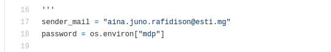
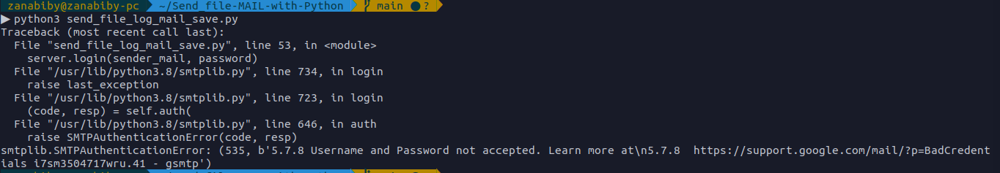
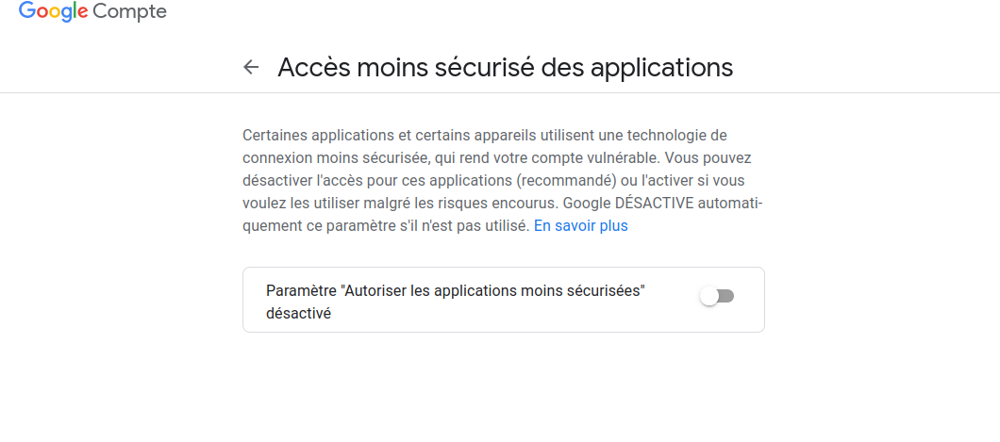
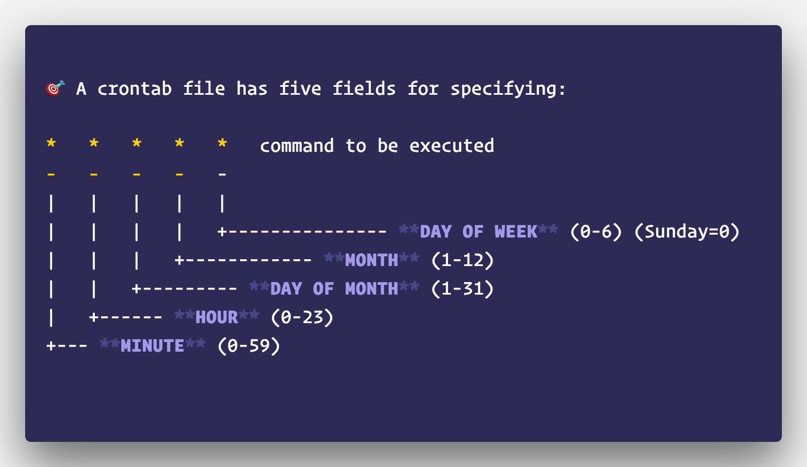
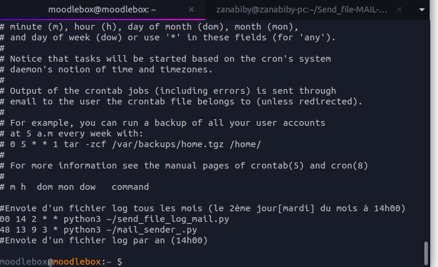

# Send_file-MAIL-with-Python
## Envoyer un fichier venant d'un serveur avec python.

Mais soyez patient 😄, tout d'abord nous allons installer **les dépendances nécessaires** si votre python vient juste d'installer :
 **pip3 install smtplib** 
 **pip3 install ssl**
 **pip3 install email**

  Dans notre code *send_file_log_mail_save.py*, il y a ceci : 
  Il faut que votre ***mot de passe*** soit enregistrée dans votre système c'est-à-dire dans *déclarer comme une variable système* si non je peux connecter avec votre email 😅 en utilisant le mot de passe que vous écrivez ici. Pour le faire , il suffit juste de faire comme ceci sur votre terminal: 
 
 **mdp="votre mot de passe"** et après **export mdp** pour vérifier que votre variable est enregistrée comme variable système tapez 👉 **env**
  Et voilà on a fini les installations et les autres instructions , lancez maintenant notre scrypte **python3 send_file_log_mail_save.py**
  ***Wouaouh 😲 😲 ça marche pas***. Ne vous inquiètez pas c'est sure que vous aurez l'erreur suivant non : 
 
  
  
#### Pour résoudre ce problème 
 Il suffit de se connecter à votre mail et [👉 cliquez ici](https://www.google.com/settings/security/lesssecureapps). Et après autoriser les applications moins sécurisées :
  

Donc voilà 😄, comme vous voyez ce petit scrypte a comme fonction de 🖇️***récuperer le fichier*** de votre choix et de ***l'envoyer à un destinataire par email.***
Et pour le lancer automatiquement, je vous conseille d'utiliser **crontab** 👍 ➡️ 

### Voici donc une petite explication pour vous aider
  

  Comme vous pouvez voir en-dessus l'explication, voici un exemple pour lancer notre scrypte :
  Nous allons faire executé notre scrypte qui permet d'envoyer le ***fichier log de notre serveur par email***  tous  ***le premier mardi du mois à 14h00***
  
